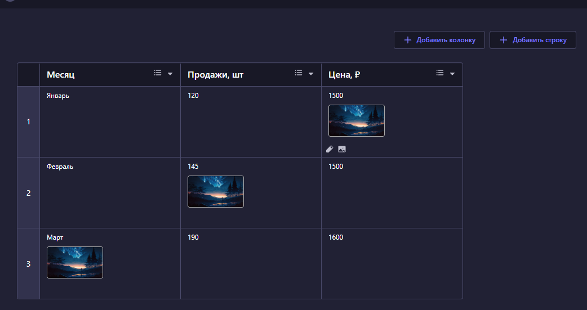
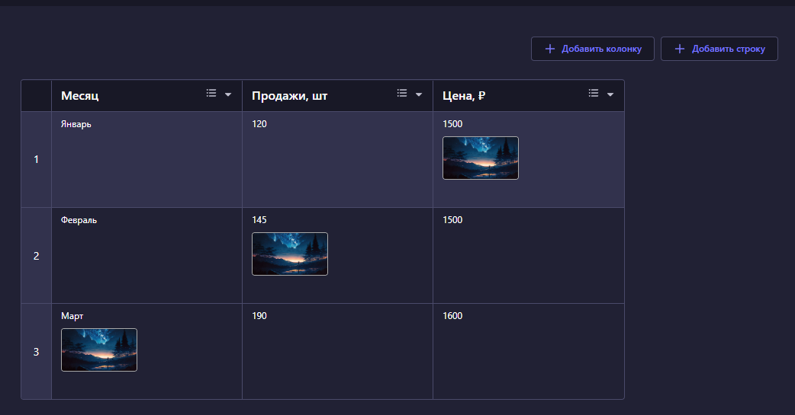
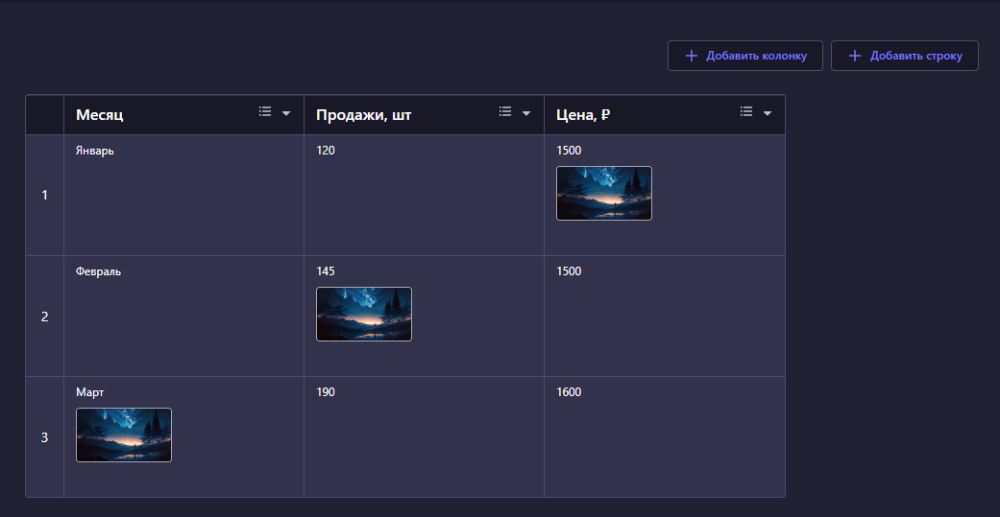

# Strapi Table Plugin

## Overview

The `strapi-table` plugin enhances your Strapi administration panel by providing advanced table functionalities, potentially including rich text editing capabilities for table cells. This plugin aims to offer a more robust and flexible way to manage tabular data within your Strapi content types.

## Features

- **Enhanced Table Management:** Provides a more powerful interface for creating and managing tables.
- **Rich Text Editing:** Integrates `react-quill-new` for rich text editing within table cells, allowing for formatted content.
- **Content Sanitization:** Utilizes `sanitize-html` to ensure that rich text content is safe and free from malicious scripts.
- **State Management:** Leverages `zustand` for efficient and scalable state management within the plugin's UI.

## Installation

To install the `strapi-table` plugin, follow these steps:

1.  **Install the package:**

    ```bash
    npm install strapi-table
    # or
    yarn add strapi-table
    ```

2.  **Enable the plugin:**
    Add the following to `./config/plugins.ts` (create the file if it doesn't exist):

    ```javascript
    {
      table: {
        enabled: true,
        resolve: '@mish.dev/strapi-table',
      },
    };
    ```

3.  **Build your Strapi admin panel:**

    ```bash
    npm run build
    # or
    yarn build
    ```

4.  **Start your Strapi application:**
    ```bash
    npm run develop
    # or
    yarn develop
    ```

## Usage

Once installed and enabled, the `Strapi Table` plugin should appear in your Strapi admin panel. You can then integrate its functionalities into your content types.





### How to Use the Table

- **Row Selection:** Clicking on a cell with a number will select the entire row.

### Hotkeys

- **`Backspace`**: Clears all content within the selected row.
- **`Delete`**: Deletes the entire selected row.

### Inserting Content

- **Insert from External Sources:** Click on the intersection of the header and rows (top-left corner) to select the entire table. This allows you to paste data from external sources, such as Google Sheets.
- **Image Insertion:** If the rich text editor within table cells supports it, you can insert images directly into the cells.

## Contributing

We welcome contributions to the `strapi-table` plugin! If you have suggestions, bug reports, or want to contribute code, please feel free to open an issue or submit a pull request.

## License

This project is licensed under the MIT License - see the [LICENSE](MIT) file for details.

## Author

Hwaiteu <benner.andrey.loon@gmail.com>
